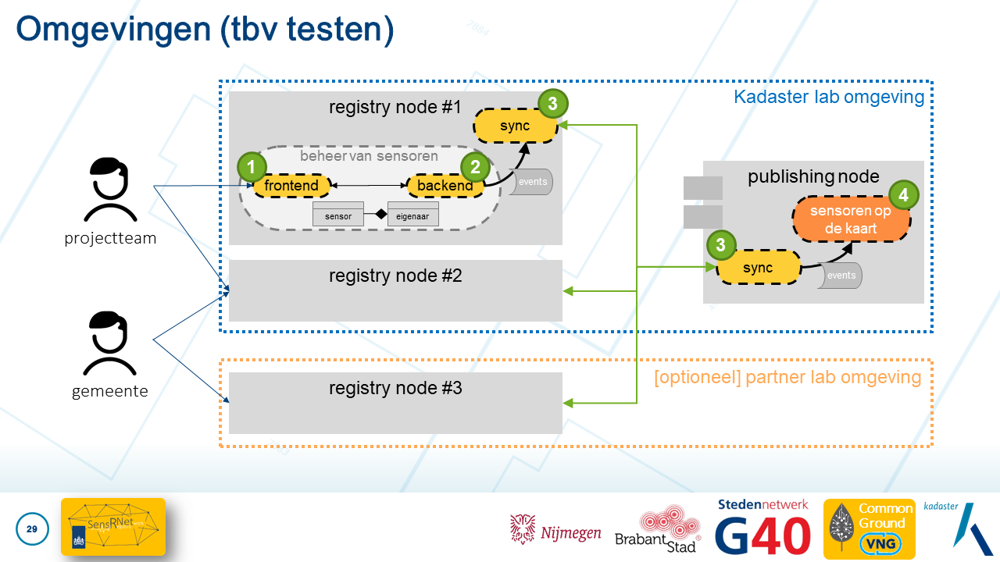

# Deployment (EN)

Deployment is about how the system is running in a (production) environment.
On this page the ideas about the end situation are described as well as the intermediate period growing towards the final situation.
This is building on the [test environment](Architecture.md#test-environments) described in the [architecture](Architecture.md) (also shown below).

The architecture is built upon one or more containers for each component.

## MultiChain implementation

The [MultiChain](SyncMultiChainEN.md) infrastructure is based on the Bitcoin Core architecture, which it extends by supplying support for permissions, assets and streams.
For Kadaster this is deployed on [Microsoft Azure](https://azure.microsoft.com/en-us/overview/).
Our MultiChain deployment has been containerized, and fits the architecture well.
This permissioned blockchain network is very resillient, as it keeps functioning and synchronizing when any individual node goes offline.

## Deployment steps

1. Set up Viewer Node
   1. Request AKS (e.g. `sensrnet-viewer-1`)
   1. Deploy MultiChain
   1. Initiate SensRNet chain
1. Set up Registry Node (repeat for each node)
   1. Request AKS (e.g. `sensrnet-registry-1`)
   1. Deploy MultiChain
   1. Join SensRNet chain
   1. Deploy Registry Backend:
      1. Deploy Mongo
      1. Deploy Eventstore
      1. Deploy Backend
   1. Deploy Sync-Bridge
   1. Deploy Registry Frontend
