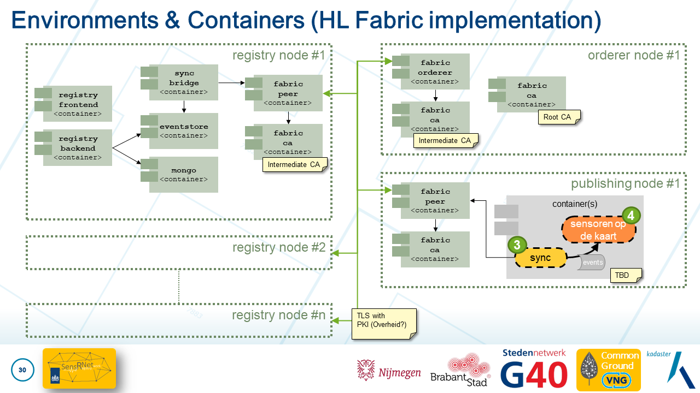
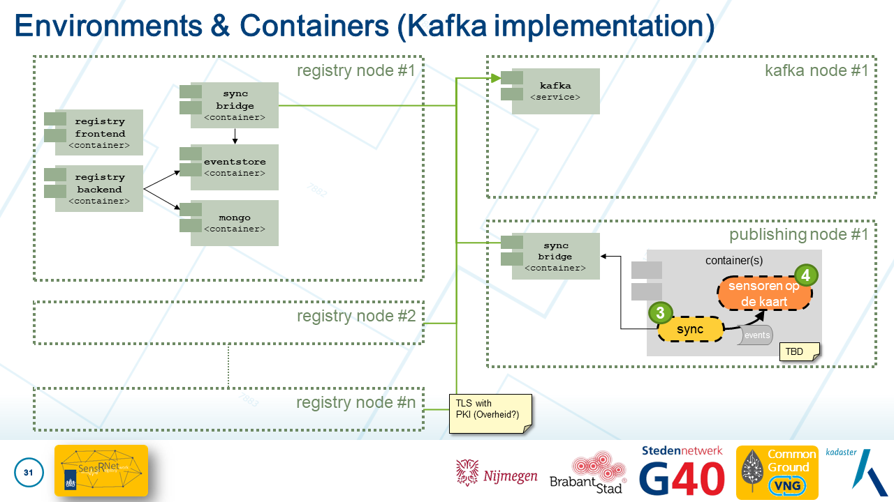

# Deployment (EN)

Deployment is about how the system is running in a (production) environment.
On this page the ideas about the end situation is described as well as the intermediate period growing towards the final situation.
This is building on the [test environment](Architecture.md#test-environments) described in the [architecture](Architecture.md) (also shown below).

The architecture is build upon one or more containers for each component.

## HyperLedger Fabric implementation

> _This is the target implementation because this has a real decentralized concept in mind._
> _For the walking skeleton demo we'll use a central implementation: [Kafka](#kafka)_

The [HyperLedger Fabric](SyncFabricEN.md) (HL Fabric) infrastructure is using the [HL Fabric CA](https://hyperledger-fabric.readthedocs.io/en/latest/glossary.html#hyperledger-fabric-ca) as 'enrollment CA' but TLS is enabled by the infrastructure platform a.k.a. existing 'PKI Overheid' standards and routing.
For Kadaster this is deployed on [Microsoft Azure](https://azure.microsoft.com/en-us/overview/).
HL Fabric is also build upon containers and fits in the architecture quite well.

## Deployment steps

1. Set up Orderer (or Root) Node
   1. Request AKS `sensrnet-orderer-1`
   1. Deploy HL Fabric Root CA
   1. Deploy HL Fabric (Intermediate) CA for Orderer Service
   1. Deploy HL Orderer Service
1. Set up Registry Node (repeat for each node)
   1. Request AKS (e.g. `sensrnet-registry-1`)
   1. Deploy HL Fabric (Intermediate) CA for Peer
   1. Create/Join channel `sensrnet-main`
   1. Deploy HL Fabric Peer incl. ChainCode
   1. Deploy Registry Backend:
      1. Deploy Mongo
      1. Deploy Eventstore
      1. Deploy Backend
   1. Deploy Sync-Bridge
   1. Deploy Registry Frontend

## Kafka implementation

> _This is only a temporary implementation to provide 'decentralized networking' simulation for the time being_

Each Registry Node is connected to a central available Kafka cluster.
This is deployed in its own Kubernetes cluster.
